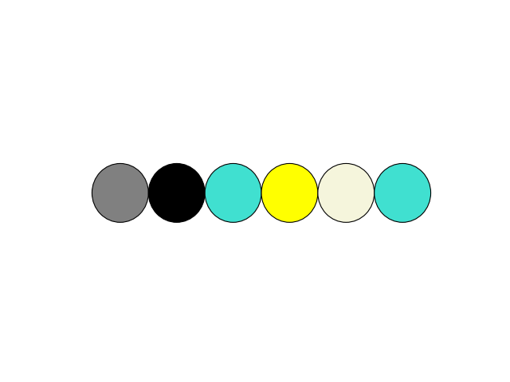
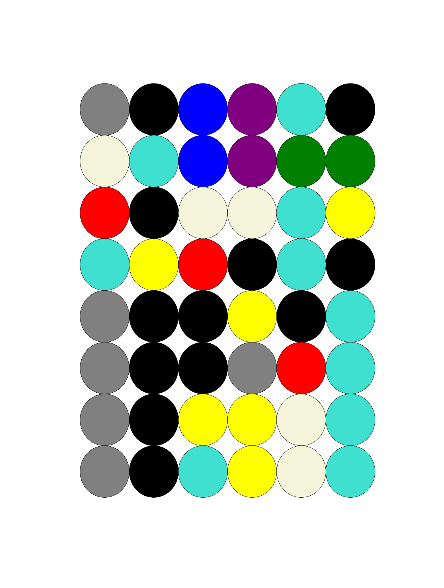

# Mastermind
Genetic algorithm playing Mastermind.

## What is mastermind

Mastermind is a game for 2 players. First one chooses a sequence of 6 colorful balls (with acceptable repeatable colors). In this variant of the game we have 9 colors:
* white
* red
* green
* purple
* turquoise
* gray
* blue
* yellow
* black

This sequence is a secret, and second player does not know it.

Second players tries to guess the sequence by proposing the sequence. The first player compares the secret sequence and the proposal. He gives back the number of balls with the correct color on the right place, and the number of balls with the correct color but on a wrong place. Thats one round of the game. Based on this two numbers second player can make another guess in next round.

Game ends when a second player guess the sequence or when he fails to do it in 10 turns.

Here is an example of physical board game looks like:

## How genetic algorithm can play this?

When we are using genetic algorithms we have the population of individuals. Each individual represents particular solution of our problem. We also have the fitness function, that grades the individuals solutions. If individual have high fitness there is higher probability, that he will pass on his genes to next generation.

To solve Mastermind each solution was encoded as sequence of natural numbers from [0, 8] interval. Each number correspond to one color. Fitness function was more interesting. We get the information about the numbers of correct balls only when we propose the solution, and we can do that 10 times before game ends. We need to find a way of grading individuals based on the information we got from previous rounds.

We have a list of our previous n trials, with the number of balls on correct places (cp) and the number on with correct colors but on wrong place (cc). So if one of solutions will have the same two numbers as the correct solution, there is very high probability it will be the correct solution (and it goes up with the number of rounds). We can use this intuition to grade our individual from population, before we choose one as our guess. Fist we can calculate the number of correct balls (scb) and balls with correct color on wrong place (scc) for given sequence compared to the sequence from i-th round. Using this we can calculate fitness as:

fitness = - (sum 2|cp[i] - scp[i]| + |cc[i] - scc[i]|)

In this equation we sum over the sequences from previous rounds. Number of balls on the correct place is more important, therefore it is multiplied by 2. Minus is changing minimalisation into maximisation (the lower the difference between proposed sequence and sequence we want to find the better). 

## Used genetic algorithm

Here simple genetic algorithm was used. Selection is based on the fitness from previous section. Crossover is done by selecting random spot in the sequence, and exchanging the alleles after this spot. Mutation is switching gene to next possible value with low probability.

Population size was 1000. Probability of crossover was 0.95 and probability of mutation 0.01.

## Sample gameplay

Sequence to guess drawn at random:

Sequences proposed by genetic algorithm:

In first 4 rounds there is more exploration. This is due to the character of fitness information. It gives more information as the game goes on. In the last 4 rounds algorithm was improving the best solution. First, second and the last ball did not changed.

In this game genetic algorithm won according to the rules. Implemented algorithm can find the solution for any sequence, but most of the times it fails to do it in the 10 rounds. The mean number of rounds needed to find a random sequence was     (for 1000 independent trials). 

Algorithm performance can be improved by more careful fine tuning of the parameters. One can think of random search for this. Also We can tweak a little a fitness function. Another approach may be introducing more complicated genetic operators, and more sophisticated selection, crossover or mutation. Implementation is flexible and allows to exchange any of this elements. 
